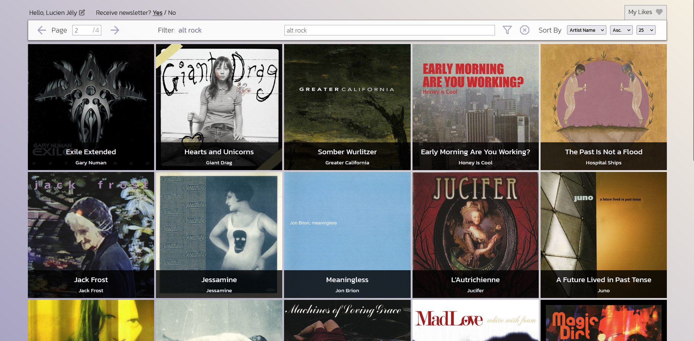
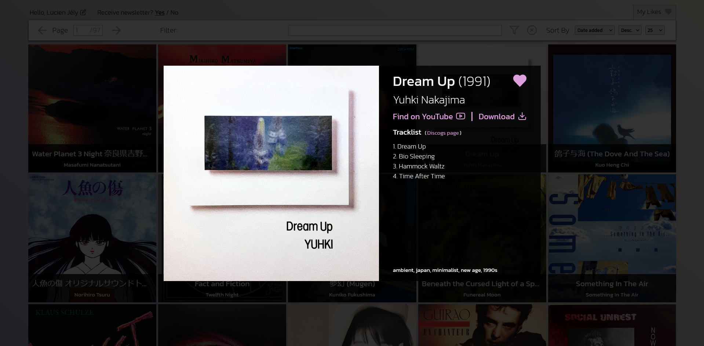
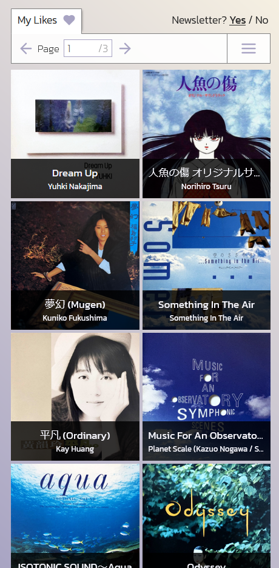
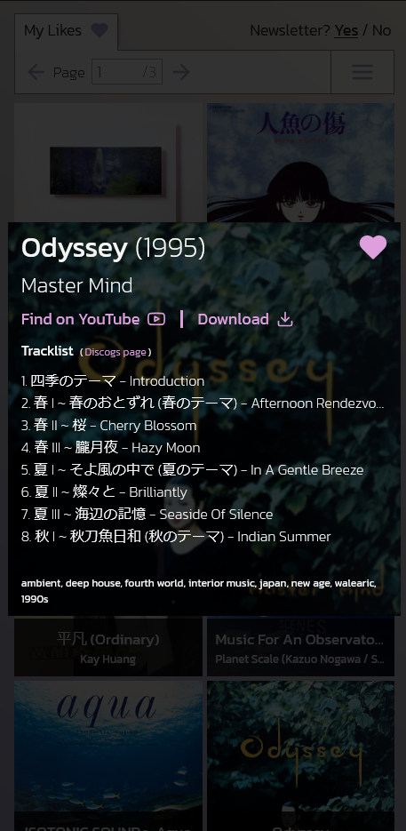

# Music Explorer V1.5

Ver 1.5 update:
    - Added a "Guest" Mode that lets you browse the database without an account
    - Added a page count to the nav bar
    - New UI for accessing likes
    - Ability to sort likes by artist, album, release year
    - Ability to display up to 100 results at once
    - Redux implementation

This repository is for the UI part of a personal project of mine. The project is made of 3 parts : 
- A database of music albums (with title, release year, artist name, tags, link to album cover).
- A custom PHP api that lets me search through it, sort it, login to an account and bookmark albums.
    (this includes a script that fetches the tracklist for a given album through the [Discogs](https://www.discogs.com/) API).
- **A React/Typescript UI to display and interact with the data.**

## The Components

- **\<UserSection\>** Display the user's display name and lets them change it. Also lets you elect to receive the newsletter of new additions.
- **\<Navbar\>** Handles all searching and sorting of the data. Calls to the API originate here and the results are passed up to the <App /> component for use in other components.
- **\<Table\>** Displays the album data as rows of album covers with text information overlayed. Tags are displayed on hover.
- **\<HighlightModal\>** A modal that opens up when an album from **\<Table\>** is clicked. It attempts to fetch the tracklist from [Discogs](https://www.discogs.com/). Contains all the information about the album. Contains the like button to bookmark an albu or remove from it from bookmarks.
- **\<CreateAccountForm\>** lets whoever has an admin account create an account by using their own login/pwd as an extra security.
- **\<LoginForm\>** is self explanatory. 

## Responsive Design

Music Explorer functions just as well on mobile as it does on desktop!

| Standard page | Page with modal open|
|--------------|---------------------|
|||

## Dependencies and Credits

- Music Explorer was built using Vite and uses "react-router-dom" and "redux-toolkit" / "react-redux".
- All icons are from [Feather Icons](https://feathericons.com/).

**Lucien Jély**
